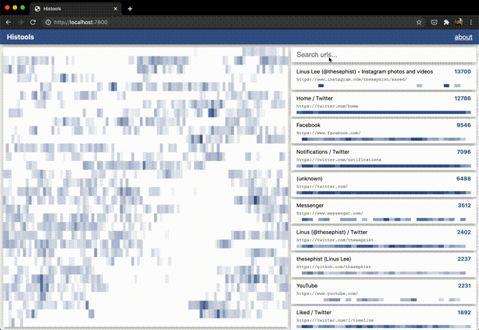

# Histools 📜

**Histools** (short for "history tools") is a collection of scripts and web UI I built to analyze my browser history over time. It provides an interactive, filterable heatmap of history entries from a Safari installation's history database. I've written more about this project on my [technical blog](https://dotink.co/posts/histools/).

Histools is built on my homebrew set of tools:

- The [Ink](https://dotink.co) programming language for the server and the analysis script
- [Torus](https://github.com/thesephist/torus) for fast, declarative UI rendering
- [paper.css](https://thesephist.github.io/paper.css/) for a clean UI aesthetic



Histools works by pulling data out of Safari's history database, which is a SQLite3 database on modern macOS systems. The web server runs locally and provides a nicer interactive experience for exploring the data.

## Features

The Histools UI focuses on three features:

- A **global heatmap** that shows the number of URLs visited over time, where each row is a 24-hour period and each column is a specific time period on each day (each block is about a 15-minute period).
- A searchable **history log** of distinct URLs visited in the last month, showing a representative page title for each URL and the number of hits that page received in the last month.
- A **mini heatmap** for each history log item that shows how often that particular page was visited in each day over the last month.

You can hover over parts of the heatmap to see more data about that spot's timestamp and number of visits.

This data is pulled from Safari's internal history database. I use Safari on the default setting, which keeps history for the last month (30-33 days). The project should also work for longer or shorter retention settings, but I haven't tested on other history databases yet. If your Safari keeps data for longer than 6 months, you might run into some lag in the UI when searching.

## How to use

If you want to spin up your own Histools dashboard, clone this repository, then follow these steps. Fair warning -- **the analysis script can be pretty slow, so you might have to be patient**.

### 1. Get Safari's history database

On macOS Catalina (the current version at time of writing), Safari keeps each user's history database in a SQLite database, saved under `~/Library/Safari/History.db`.

Histools expects to operate on a database in the root of the project directory. So move that file to the root of the project. To access this file, you might have to [enable Full Disk Access](https://developer.apple.com/forums/thread/107546) in your System Preferences.

```
cp ~/Library/Safari/History.db ./History.db
```

_Note: because this is a normal SQLite database, you can explore the full database with your local sqlite3 tool. Run `sqlite3 History.db` to enter a SQL shell and start by running `.schema` to check out what this database looks like._

### 2. Run the analysis script

The analysis script is written in [Ink](https://dotink.co), so at the moment it's quite slow (especially since I haven't paid much attention to optimizing it, either).

Because you probably don't have Ink installed on your system, the repository contains a vendored binary for Linux and macOS systems. In addition, the script `run.sh` takes care of both this step (2) and the next step (3) for you, if you want to take that shortcut.

```
./run.sh
```

If you want to run the script separately, you can instead run

```
./bin/ink-darwin export.ink History.db
```

The analysis script will save a JSON export to `static/data.json`, which the web app will consume.

### 3. Open up the heatmap visualizer

If you ran the `./run.sh` script, after the analysis file is saved, the script should open up a server to `localhost:7800` automatically.

If you want to open a server separately, you can use whatever server you prefer to statically serve `./static`. The repo comes with a server written in Ink -- for that, run

```
./bin/ink-darwin vendor/fileserver.ink
```

Open up `localhost:7800`, and start exploring the data!
